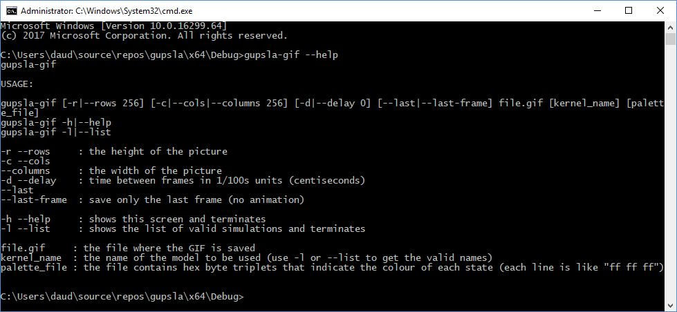
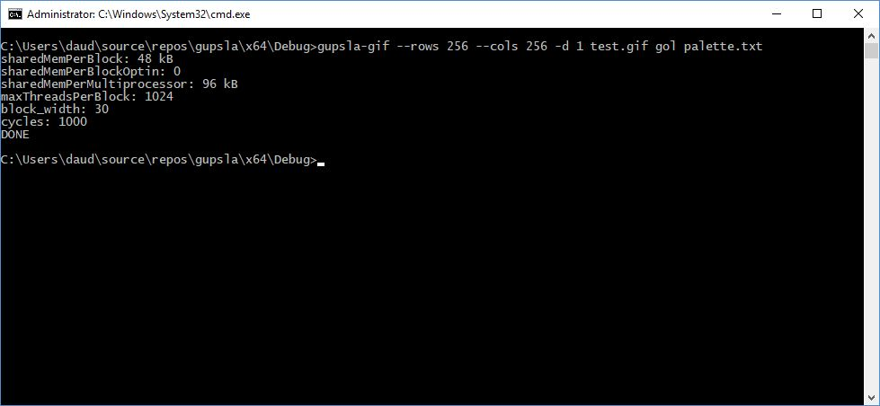
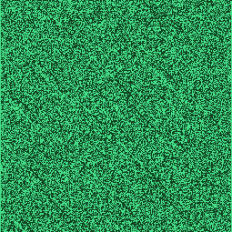
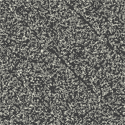

# gupsla
Gpu-based User Programmable Sqauare Lattice Automata

[Download Windows binaries](https://github.com/DAud-IcI/gupsla/raw/master/x64/Debug.zip) (tested on Windows 10 x64 with CUDA v9.0)

